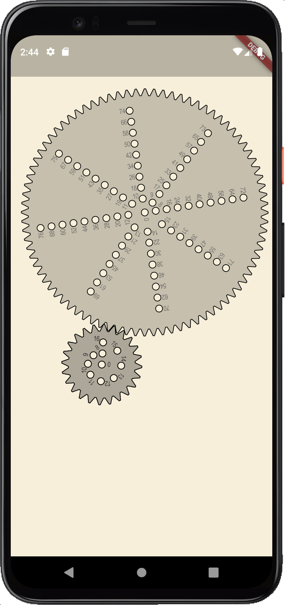

# Inspiral

Create beautiful spirals with gears.



## Developing

This app is built using [Flutter](https://flutter.dev/).

### Running

```sh
flutter run
```

See the [Flutter
documentation](https://flutter.dev/docs/development/tools/devtools/cli) for more
information about running and debugging a Flutter application locally.

_Note:_ I've mostly been using the [VSCode
plugin](https://flutter.dev/docs/development/tools/devtools/vscode) to launch
and debug the app.

### Generating gears

Gear are generated by the [`gear_generator/`](gear_generator/src/index.ts) Node
application. See the [README in that directory](gear_generator/README.md) for
more information about this process.
